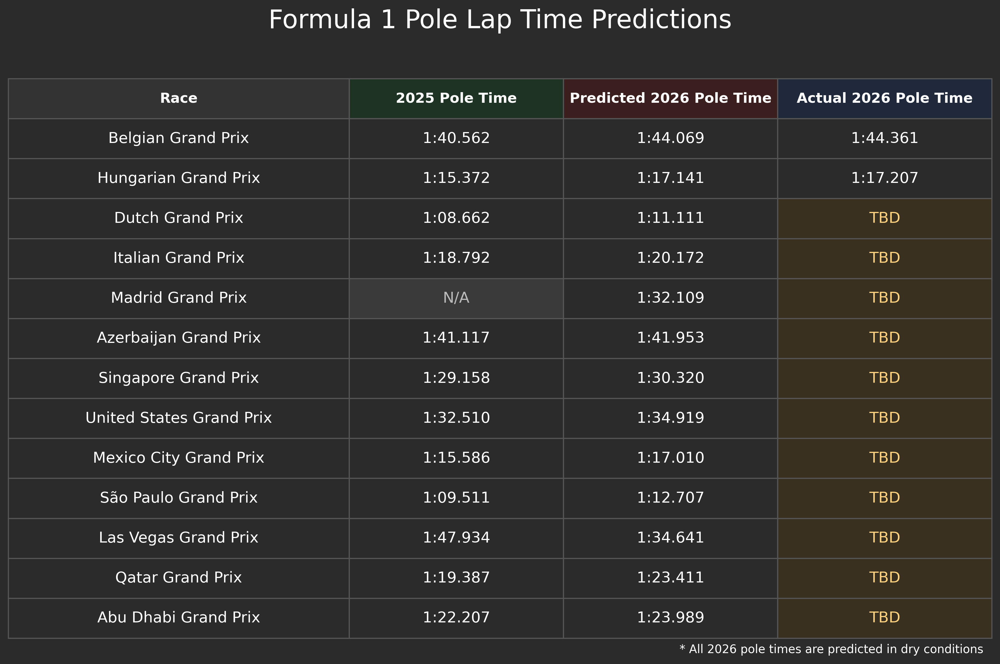
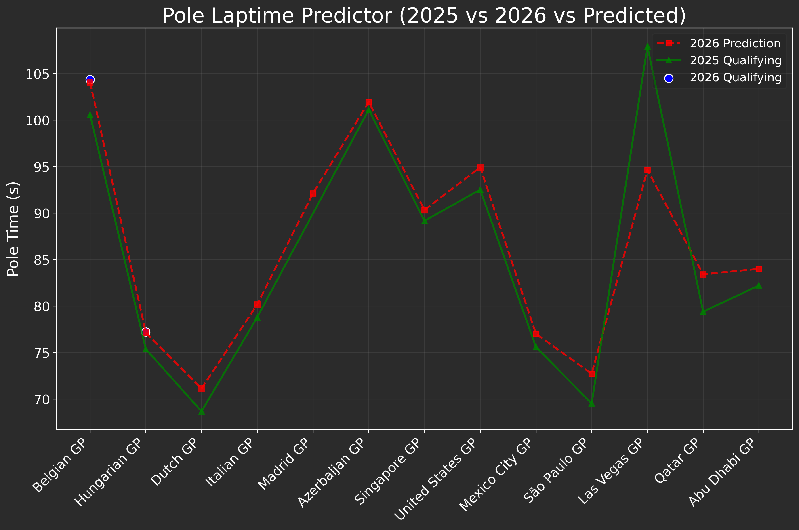
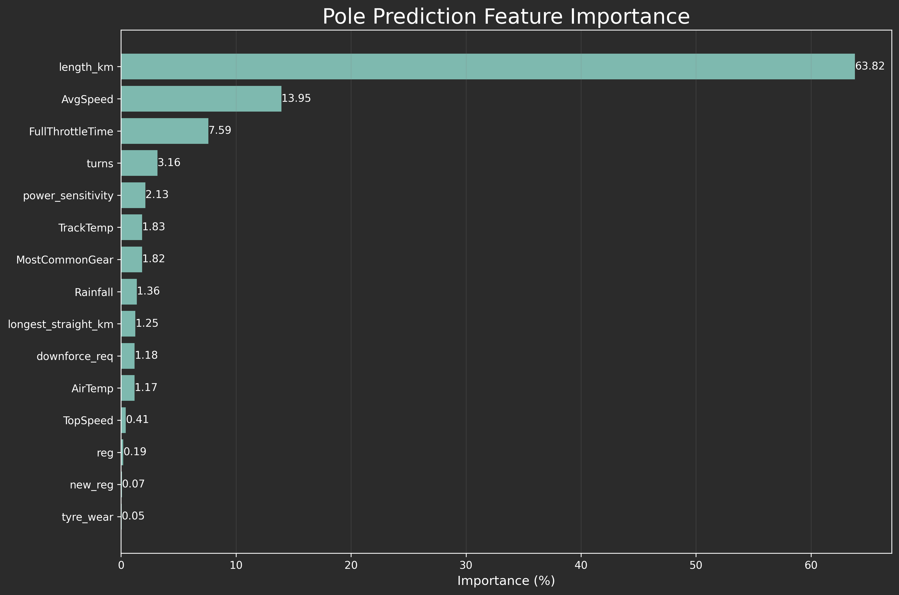

# PoleTimePredictor

A machine learning pipeline that predicts Formula 1 qualifying pole times using historical race data, telemetry, weather conditions, and circuit characteristics.

Note: This is v3 of the project. Future versions with improvements are coming soon.

## How It Works

The project follows a five-stage pipeline:

**Data Extraction** (`extract_datatable.py`) — Pulls qualifying session data using the FastF1 API, one season at a time to help manage API rate limits, appending new races to the existing dataset without redoing ones already collected. For each race, it records the pole-sitter's lap time, telemetry from the pole lap itself (top speed, average speed, time spent at full throttle, most common gear), and average weather conditions during the session (air temp, track temp, humidity, pressure, rainfall). All datasets now live under a `datasets/` folder to keep the repo root tidy.

**Merging & Cleaning** (`merge_tables.py`) — Filters out qualifying sessions run on outdated circuit layouts (pre-2023 Singapore, 2019–2022 Spanish/Barcelona, pre-2020 Australian) so the model isn't trained on track configurations that no longer exist, standardizes race naming across seasons (e.g. "Barcelona Grand Prix" → "Spanish Grand Prix", "Brazilian Grand Prix" → "São Paulo Grand Prix", "Mexican Grand Prix" → "Mexico City Grand Prix"), then merges the cleaned race data with circuit-specific characteristics (track type, length, DRS zones, tyre wear, downforce requirements, etc.) to build the training set.

**Future Race Feature Building** (`create_future_races.py`) — Builds the feature set for the remaining 2026 races. Pulls the current 2026 calendar from FastF1, averages recent weather and telemetry (2022 onward) per circuit, and applies a correction to the telemetry features based on the overall average deviation between 2023–2025 telemetry and the 2026 races completed so far — accounting for the new 2026 regulations rather than assuming cars behave like prior years. Also handles 2026-specific calendar changes (e.g. renaming "Spanish Grand Prix" to "Madrid Grand Prix", excluding Bahrain from the remaining schedule) before merging in circuit characteristics.

**Hyperparameter Tuning** (`parameterTesting.py`) — Runs a grid search over CatBoost parameters (iterations, depth, learning rate) using time-respecting cross-validation (`TimeSeriesSplit`, 5 folds), so each fold only validates on races chronologically after what it trained on. Results are ranked by average MAE across folds and saved to `datasets/catboost_tuning_results.csv`.

**Prediction** (`predictor.py`) — Trains a `CatBoostRegressor` on the merged historical dataset (using the best parameters found via tuning) and predicts pole times for the upcoming races. Categorical features (`tyre_wear`, `downforce_req`, `Rainfall`, `new_reg`, `reg`) are passed natively rather than one-hot encoded. It also prints feature importances to show which factors most influence pole time.

**Visualization** (`plotting.py`) — Builds three figures to interpret and communicate the model's output: a summary table comparing 2025 pole times, predicted 2026 pole times, and actual 2026 qualifying results (where available); a trend line comparing all three across the season; and a horizontal bar chart of the top 15 most important features driving the model's predictions.

## Sample Output

**Pole time summary table**



**2025 vs. predicted 2026 vs. actual 2026 pole times**



**Feature importance**



## Versions

### v1
- Initial pipeline: FastF1 extraction of qualifying + weather data (2022–2026), merged with a manually compiled `circuits_info.csv`.
- Upcoming races for prediction were defined as a fixed, manually written list.
- Model: `RandomForestRegressor` (500 estimators), trained on one-hot encoded weather + static circuit characteristics.

### v2
- Backfilled historical data with 2019–2021 seasons, run year-by-year to stay within FastF1 API rate limits, and `extract_datatable.py` now appends new races to the existing dataset instead of rebuilding it from scratch each run.
- Added telemetry features derived from each pole lap: top speed, average speed, time spent at full throttle, and most common gear.
- Added a 2026 regulation correction: the observed difference between 2026 telemetry and historical averages is calculated and applied to future race predictions, rather than assuming the new regulation era behaves like previous years.
- `merge_tables.py` now pulls the remaining 2026 calendar dynamically from FastF1's event schedule instead of a hardcoded race list.
- Added an engineered `lengthxturns` feature (circuit length × turn count).
- Dropped `WindSpeed` from the weather features — it added too much noise for the model to learn from usefully.
- Replaced the static `avg_speed_kmh` circuit characteristic with the telemetry-derived `AvgSpeed` — actual measured average lap speed for historical races, and the corrected/expected average speed (via the 2026 regulation correction) for upcoming races.
- Switched the model from Random Forest to CatBoost, which handles categorical features natively instead of one-hot encoding.
- Dropped `Year`, `drs_zones_prev`, and `active_aero_zones` from the final feature set after testing showed they weren't pulling their weight.
- Added `parameter_testing.py` for CatBoost hyperparameter tuning via time-series cross-validation.

### v3
- Split the future-race feature engineering out of `merge_tables.py` into its own script, `create_future_races.py`, so merging/cleaning the historical dataset and building the upcoming-race feature set are now separate, independently runnable steps.
- `merge_tables.py` now filters out qualifying sessions from outdated circuit layouts (pre-2023 Singapore, 2019–2022 Spanish/Barcelona, pre-2020 Australian) and standardizes race naming across seasons, so the same circuit is represented consistently regardless of the name FastF1 reported for it that year.
- The 2026 telemetry correction is now a single overall average deviation per telemetry feature (2023–2025 baseline vs. 2026 races completed so far), rather than being grouped by circuit type.
- `create_future_races.py` now handles 2026-specific calendar quirks directly: it excludes Bahrain from the remaining schedule and renames "Spanish Grand Prix" to "Madrid Grand Prix" to reflect the 2026 calendar change.
- Added new regulation-era categorical features, `new_reg` and `reg`, as native CatBoost inputs alongside `tyre_wear`, `downforce_req`, and `Rainfall`.
- `Race` and circuit `type` are no longer used as model features — both are dropped from the training data before fitting, leaving `tyre_wear`, `downforce_req`, `Rainfall`, `new_reg`, and `reg` as the only native categorical inputs.
- `parameterTesting.py` now explicitly casts categorical columns to strings before tuning, and its grid search (iterations 1500/2000, depth 3/4, learning rate 0.01/0.025/0.05) informed the final model settings in `predictor.py` (`iterations=2000, depth=3, learning_rate=0.025`).
- Added `plotting.py`, a new visualization stage: a summary table of 2025/predicted-2026/actual-2026 pole times, a trend line comparing them across the season, and a feature-importance bar chart — all styled with a dark theme for presentation.

## Project Structure

| File | Description |
|---|---|
| `extract_datatable.py` | Pulls qualifying, telemetry, and weather data per race via FastF1 (run per-season to manage rate limits) → outputs/updates `datasets/pole_dataset.csv` |
| `merge_tables.py` | Filters out outdated circuit layouts, standardizes race names, and merges race data with circuit info → outputs `datasets/pole_mergeset.csv` |
| `create_future_races.py` | Builds the feature set for upcoming 2026 races (weather/telemetry averages, 2026 regulation correction, calendar handling) → outputs `datasets/future_races.csv` |
| `parameterTesting.py` | Grid search + time-series cross-validation for CatBoost hyperparameters → outputs `datasets/catboost_tuning_results.csv` |
| `predictor.py` | Trains the CatBoost model and generates predictions → outputs `datasets/future_predictions.csv` |
| `plotting.py` | Builds the summary table, trend comparison plot, and feature importance chart → outputs saved to `images/` |
| `datasets/circuits_info.csv` | Circuit characteristics (type, length, DRS zones, tyre wear, downforce, etc.), compiled by the author |
| `datasets/pole_dataset.csv` | Raw extracted qualifying + telemetry + weather data per race |
| `datasets/pole_mergeset.csv` | Final training set (race data + circuit info merged) |
| `datasets/future_races.csv` | Feature set for upcoming races to predict |
| `datasets/future_predictions.csv` | Model's predicted pole times for upcoming races |
| `datasets/catboost_tuning_results.csv` | Results of the hyperparameter grid search, ranked by average MAE |
| `datasets/all_f1_circuits.csv` | Reference circuit data (source: Kaggle, see Data Sources) |
| `datasets/f1_2026_tracks.csv` | Reference 2026 calendar/track data (source: Kaggle, see Data Sources) |
| `images/` | Charts generated by `plotting.py` (`pole_prediction_table.png`, `pole_prediction_graph.png`, `feature_importance.png`) |

## Data Sources
- **FastF1** — live extraction of qualifying results, telemetry, and weather data.
- `datasets/circuits_info.csv` — compiled by the author.
- **Pitwall Analytics (Kaggle)** — reference data used while compiling circuit info.
- **Formula 1 Circuits 1950–Present (Kaggle)** — reference data used while compiling circuit info.

## Setup

```
pip install fastf1 pandas scikit-learn catboost matplotlib
```

## Usage

Run the pipeline in order:

```
python extract_datatable.py     # builds/updates datasets/pole_dataset.csv (run per season to manage API rate limits)
python merge_tables.py          # cleans and merges historical data into datasets/pole_mergeset.csv
python create_future_races.py   # builds datasets/future_races.csv for upcoming 2026 races
python parameterTesting.py      # (optional) tunes CatBoost hyperparameters
python predictor.py             # trains the model, outputs datasets/future_predictions.csv
python plotting.py              # generates images/pole_prediction_table.png, images/pole_prediction_graph.png, images/feature_importance.png
```

Note: `extract_datatable.py` caches FastF1 data locally under `fastf1_cache/` to avoid repeated downloads. It's designed to be run one season (or a small range) at a time — new races are appended to `datasets/pole_dataset.csv` rather than the whole dataset being rebuilt, which helps avoid hitting FastF1's API rate limits.

## Model

- **Algorithm:** CatBoost Regressor
- **Target:** Pole qualifying lap time (seconds)
- **Features:** Telemetry from the pole lap — top speed, average speed (measured for historical races, corrected/expected for 2026 races), full-throttle time, most common gear — plus weather conditions (air temp, track temp) and circuit characteristics (length, tyre wear, downforce requirement, power sensitivity, turns), along with regulation-era indicators (`new_reg`, `reg`).
- **Categorical features** (`tyre_wear`, `downforce_req`, `Rainfall`, `new_reg`, `reg`) are passed natively to CatBoost rather than one-hot encoded. `Race` and circuit `type` are excluded from the model's training features as of v3.
- Best hyperparameters are selected via time-series cross-validation in `parameterTesting.py` before being used in the final model.

### Feature Reference

Every column available in the merged dataset, and whether it's currently fed into the model:

| Feature | Included in model? |
|---|---|
| TopSpeed | Yes |
| AvgSpeed | Yes |
| FullThrottleTime | Yes |
| MostCommonGear | Yes |
| AirTemp | Yes |
| TrackTemp | Yes |
| Humidity | No |
| Pressure | No |
| Rainfall | Yes |
| length_km | Yes |
| tyre_wear | Yes |
| downforce_req | Yes |
| power_sensitivity | Yes |
| turns | Yes |
| new_reg | Yes |
| reg | Yes |
| type (circuit type) | No |
| drs_zones_prev | No |
| active_aero_zones | No |
| Race | No |
| Year | No |
| Round | No |

## Author

Jazib Ahmed
